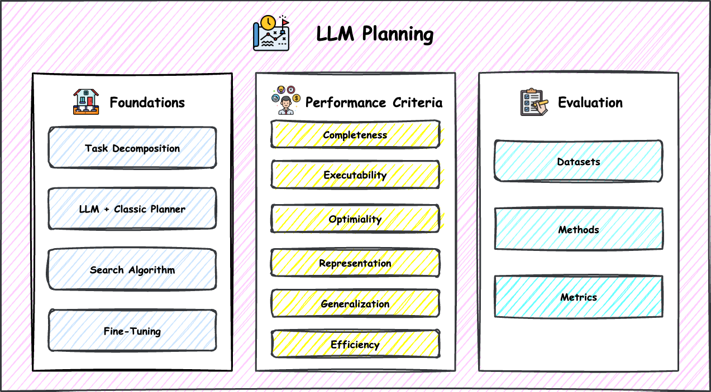

# Awesome-LLM-Planning-Capability
[](https://awesome.re)

A curated list of papers and resources based on our survey paper [**"PlanGenLLMs: A Modern Survey of LLM Planning Capabilities"**](https://arxiv.org/abs/2502.11221), which is published at **ACL 2025**.



**Please cite the paper in [Citation](https://github.com/wll199566/awesome-llm-planning-capability#citation) if you find the paper list and resources in this repository helpful for your research. Thanks!**

## Introduction

LLMs have immense potential for generating plans, transforming an initial world state into a desired goal state. A large body of research has explored the use of LLMs for various planning tasks, from web navigation to travel planning and database querying. However, many of these systems are tailored to specific problems, making it challenging to compare them or determine the best approach for new tasks. There is also a lack of clear and consistent evaluation criteria. Our survey aims to offer a comprehensive overview of current LLM planners to fill this gap. It builds on foundational work by [Kartam and Wilkins (1990)](https://stacks.stanford.edu/file/druid:pt284sd5701/TR008.pdf) and examines six key performance criteria: **completeness**, **executability**, **optimality**, **representation**, **generalization**, and **efficiency**. For each, we provide a thorough analysis of representative works and highlight their strengths and weaknesses. Our paper also identifies crucial future directions, making it a valuable resource for both practitioners and newcomers interested in leveraging LLM planning to support agentic workflows.

## Contents

- [Awesome-LLM-Planning-Capability ](#awesome-llm-planning-capability)
  - [Introduction](#introduction)
  - [Contents](#contents)
  - [LLM Planning Foundations](#llm-planning-foundation)
    - [Introduction](#foundation-introduction)
    - [Task Decomposition](#task-decomposition)
    - [LLM + Classical Planner ](#llm-classical-planner)
    - [Search Algorithm](#search-algorithm)
    - [Fine-Tuning](#fine-tuning)
  - [Performance Criteria](#performance-criteria )
    - [Introduction](#performance-criteria-introduction)
    - [Completeness](#completeness)
      - [Plan Correctness](#plan-correctness)
      - [Plan Achievability](#plan-achievability)
    - [Executability](#executability)
      - [Object Grounding](#object-grounding)
      - [Action Grounding](#action-grounding)
      - [Sample-then-Filter](#sample-then-filter)
      - [Closed-Loop System](#closed-loop-system)
    - [Optimality](#optimality)
      - [LLM + Optimizer ](#llm-optimizer)
      - [A* Search-Based Methods](#a-search-methods)
    - [Representation](#representation)
      - [LLM-as-a-Translator](#llm-as-a-translator)
      - [LLM-as-a-Planner](#llm-as-a-planner)
    - [Generalization](#generalization)
      - [Fine-Tuning](#fine-tuning-generalization)
      - [Generalized Planning](#generalized-planning)
      - [Skill Storage](#generalized-planning)
    - [Efficiency](#efficiency)
      - [Reduced LLM and World Model Calls](#reduce-llm-world-model-calls)
      - [Shorter Inputs and Outputs](#shorter-inputs-outputs)
      - [Smaller Model Size](#smaller-model-size)
  - [Evaluation](#evaluation)
    - [Introduction](#evaluation-introduction)
    - [Datasets](#evaluation-datasets)
      - [Planning Focused](#planning-focused-dataset)
      - [Downstream Tasks](#downstream-tasks-datasets)
    - [Methods](#evaluation-methods)
      - [Verifier and Groundtruth](#verifier-groundtruth)
      - [Human Evaluation](#human-evaluation)
      - [LLM-as-a-Judge](#llm-as-a-judge) 
    - [Metrics](#evaluation-metrics)
  - [Other Related Surveys](#other-surveys)
  - [Citations](#citations)


## LLM Planning Foundations

### Task Decomposition
1. **Describe, Explain, Plan and Select: Interactive Planning with LLMs Enables Open-World Multi-Task Agents** `NeurIPS 2023` 

  *Zihao Wang, Shaofei Cai, Guanzhou Chen, Anji Liu, Xiaojian Ma, Yitao Liang* [[PDF](https://arxiv.org/pdf/2302.01560)] [[Code](https://github.com/CraftJarvis/MC-Planner)]

2. **ProgPrompt: Generating Situated Robot Task Plans using Large Language Models.** `ICRA 2023` 
  *Ishika Singh, Valts Blukis, Arsalan Mousavian, Ankit Goyal, Danfei Xu, Jonathan Tremblay, Dieter Fox, Jesse Thomason, Animesh Garg* [[PDF](https://arxiv.org/abs/2209.11302)] [[Code](https://github.com/NVlabs/progprompt-vh)]

3. **Can Graph Learning Improve Planning in LLM-based Agents?** `NeurIPS 2024`
  *Xixi Wu, Yifei Shen, Caihua Shan, Kaitao Song, Siwei Wang, Bohang Zhang, Jiarui Feng, Hong Cheng, Wei Chen, Yun Xiong, Dongsheng Li* [[PDF](https://arxiv.org/pdf/2405.19119)] [[Code](https://github.com/WxxShirley/GNN4TaskPlan)]

4. **AdaPlanner: Adaptive Planning from Feedback with Language Models** `NeurIPS 2023`
  *Haotian Sun, Yuchen Zhuang, Lingkai Kong, Bo Dai, Chao Zhang* [[PDF](https://arxiv.org/pdf/2305.16653)] [[Code](https://github.com/haotiansun14/AdaPlanner)]

5. **SelfGoal: Your Language Agents Already Know How to Achieve High-level Goals** `NACCL 2025` 
  *Ruihan Yang, Jiangjie Chen, Yikai Zhang, Siyu Yuan, Aili Chen, Kyle Richardson, Yanghua Xiao, Deqing Yang* [[PDF](https://arxiv.org/pdf/2406.04784)] [[Code](https://github.com/rhyang2021/SELFGOAL)]

6. **Adapt: As-needed decomposition and planning with language models** `NAACL 2024 Findings`
  *Archiki Prasad, Alexander Koller, Mareike Hartmann, Peter Clark, Ashish Sabharwal, Mohit Bansal, Tushar Khot* [[PDF](https://arxiv.org/pdf/2311.05772)] [[Code](https://github.com/archiki/ADaPT)]


### LLM + Classic Planners
1. **LLM+P: Empowering Large Language Models with Optimal Planning Proficiency** `Preprint`
*Bo Liu, Yuqian Jiang, Xiaohan Zhang, Qiang Liu, Shiqi Zhang, Joydeep Biswas, Peter Stone* [[PDF](https://arxiv.org/pdf/2304.11477)] [[Code](https://github.com/Cranial-XIX/llm-pddl)]

2. **Dynamic Planning with a LLM** `NeurIPS 2024 LanGame Workshop`
*Gautier Dagan, Frank Keller, Alex Lascarides* [[PDF](https://arxiv.org/pdf/2308.06391)] [[Code](https://github.com/itl-ed/llm-dp)]

3. **Leveraging Pre-trained Large Language Models to Construct and Utilize World Models for Model-based Task Planning** `NeurIPS 2023`
*Lin Guan, Karthik Valmeekam, Sarath Sreedharan, Subbarao Kambhampati* [[PDF](https://arxiv.org/pdf/2305.14909)] [[Code](https://github.com/GuanSuns/LLMs-World-Models-for-Planning)]

4. **Language Agent Tree Search Unifies Reasoning Acting and Planning in Language Models** `ICML 2024`
*Andy Zhou, Kai Yan, Michal Shlapentokh-Rothman, Haohan Wang, Yu-Xiong Wang* [[PDF](https://arxiv.org/pdf/2310.04406)] [[Code](https://github.com/lapisrocks/LanguageAgentTreeSearch)]

5. **On the Planning Abilities of Large Language Models (A Critical Investigation with a Proposed Benchmark)** `NeurIPS 2023`
*Karthik Valmeekam, Sarath Sreedharan, Matthew Marquez, Alberto Olmo, Subbarao Kambhampati* [[PDF](https://arxiv.org/pdf/2302.06706)] [[Code](https://github.com/karthikv792/LLMs-Planning)]

6. **What's the Plan? Evaluating and Developing Planning-Aware Techniques for Language Models** `Preprint`
*Eran Hirsch, Guy Uziel, Ateret Anaby-Tavor* [[PDF](https://arxiv.org/pdf/2402.11489)]

7. **Tree Search for Language Model Agents** `Preprint`
*Jing Yu Koh, Stephen McAleer, Daniel Fried, Ruslan Salakhutdinov* [[PDF](https://arxiv.org/pdf/2302.06706)] [[Code](https://github.com/kohjingyu/search-agents)]


### Search Algorithm
1. **Tree of Thoughts: Deliberate Problem Solving with Large Language Models** `NeurIPS 2023`
*Shunyu Yao, Dian Yu, Jeffrey Zhao, Izhak Shafran, Thomas L. Griffiths, Yuan Cao, Karthik Narasimhan* [[PDF](https://arxiv.org/pdf/2305.10601)] [[Code](https://github.com/princeton-nlp/tree-of-thought-llm)]

2. **Thought of Search: Planning with Language Models Through The Lens of Efficiency** `NeurIPS 2024`
*Michael Katz, Harsha Kokel, Kavitha Srinivas, Shirin Sohrabi* [[PDF](https://arxiv.org/pdf/2404.11833)]

3. **Large Language Models as Commonsense Knowledge for Large-Scale Task Planning** `NeurIPS 2023`
*Zirui Zhao, Wee Sun Lee, David Hsu* [[PDF](https://arxiv.org/pdf/2305.14078)] [[Code](https://github.com/1989Ryan/llm-mcts)]

4. **Reasoning with Language Model is Planning with World Model** ``
*Shibo Hao, Yi Gu, Haodi Ma, Joshua Jiahua Hong, Zhen Wang, Daisy Zhe Wang, Zhiting Hu* [[PDF](https://arxiv.org/pdf/2305.14992)] [[Code](https://github.com/Ber666/RAP)]

5. **Language Agent Tree Search Unifies Reasoning Acting and Planning in Language Models** `ICML 2024`
*Andy Zhou, Kai Yan, Michal Shlapentokh-Rothman, Haohan Wang, Yu-Xiong Wang* [[PDF](https://arxiv.org/pdf/2310.04406)] [[Code](https://github.com/lapisrocks/LanguageAgentTreeSearch)]

6. **What's the Plan? Evaluating and Developing Planning-Aware Techniques for Language Models** `Preprint`
*Eran Hirsch, Guy Uziel, Ateret Anaby-Tavor* [[PDF](https://arxiv.org/pdf/2402.11489)]

7. **Tree Search for Language Model Agents** `Preprint`
*Jing Yu Koh, Stephen McAleer, Daniel Fried, Ruslan Salakhutdinov* [[PDF](https://arxiv.org/pdf/2302.06706)] [[Code](https://github.com/kohjingyu/search-agents)]

8. **Monte Carlo Planning with Large Language Model for Text-Based Game Agents** `ICLR 2025`
*Zijing Shi, Meng Fang, Ling Chen* [[PDF](https://arxiv.org/pdf/2504.16855)] [[Code](https://github.com/winni18/MC-DML)]

9. **Scaling Autonomous Agents via Automatic Reward Modeling And Planning** `ICLR 2025`
*Zhenfang Chen, Delin Chen, Rui Sun, Wenjun Liu, Chuang Gan* [[PDF](https://arxiv.org/pdf/2502.12130)] [[Code](https://github.com/heaplax/ARMAP)]


### Fine-Tuning
1. **Visually-Grounded Planning without Vision: Language Models Infer Detailed Plans from High-level Instructions** `EMNLP 2020 Findings`
*Peter A. Jansen* [[PDF](https://arxiv.org/pdf/2009.14259)]

2. **Learning to Reason over Scene Graphs: A Case Study of Finetuning GPT-2 into a Robot Language Model for Grounded Task Planning** `Frontiers in Robotics and AI`
*Georgia Chalvatzaki, Ali Younes, Daljeet Nandha, An Le, Leonardo F. R. Ribeiro, Iryna Gurevych* [[PDF](https://arxiv.org/pdf/2305.07716)]

3. **Trial and Error: Exploration-Based Trajectory Optimization for LLM Agents** `ACL 2024`
 *Yifan Song, Da Yin, Xiang Yue, Jie Huang, Sujian Li, Bill Yuchen Lin* [[PDF](https://arxiv.org/pdf/2403.02502)] [[Code](https://github.com/Yifan-Song793/ETO)]

4. **Agent-FLAN: Designing Data and Methods of Effective Agent Tuning for Large Language Models** `ACL 2024 Findings`
*Zehui Chen, Kuikun Liu, Qiuchen Wang, Wenwei Zhang, Jiangning Liu, Dahua Lin, Kai Chen, Feng Zhao* [[PDF](https://arxiv.org/pdf/2403.12881)] [[Code](https://github.com/InternLM/Agent-FLAN)]

5. **AgentOhana: Design Unified Data and Training Pipeline for Effective Agent Learning** `NAACL 2025`
*Jianguo Zhang, Tian Lan, Rithesh Murthy, Zhiwei Liu, Weiran Yao, Ming Zhu, Juntao Tan, Thai Hoang, Zuxin Liu, Liangwei Yang, Yihao Feng, Shirley Kokane, Tulika Awalgaonkar, Juan Carlos Niebles, Silvio Savarese, Shelby Heinecke, Huan Wang, Caiming Xiong* [[PDF](https://arxiv.org/pdf/2402.15506)] [[Code](https://github.com/SalesforceAIResearch/xLAM)]

6. **Learning From Failure: Integrating Negative Examples when Fine-tuning Large Language Models as Agents** `NAACL 2025`
*Renxi Wang, Haonan Li, Xudong Han, Yixuan Zhang, Timothy Baldwin* [[PDF](https://arxiv.org/pdf/2402.11651)] [[Code](https://github.com/Reason-Wang/NAT)]


## Citation

Please cite the following paper if you find the resource helpful for your research.

```
@article{wei2025plangenllms,
  title={Plangenllms: A modern survey of llm planning capabilities},
  author={Wei, Hui and Zhang, Zihao and He, Shenghua and Xia, Tian and Pan, Shijia and Liu, Fei},
  journal={arXiv preprint arXiv:2502.11221},
  year={2025}
}
```


